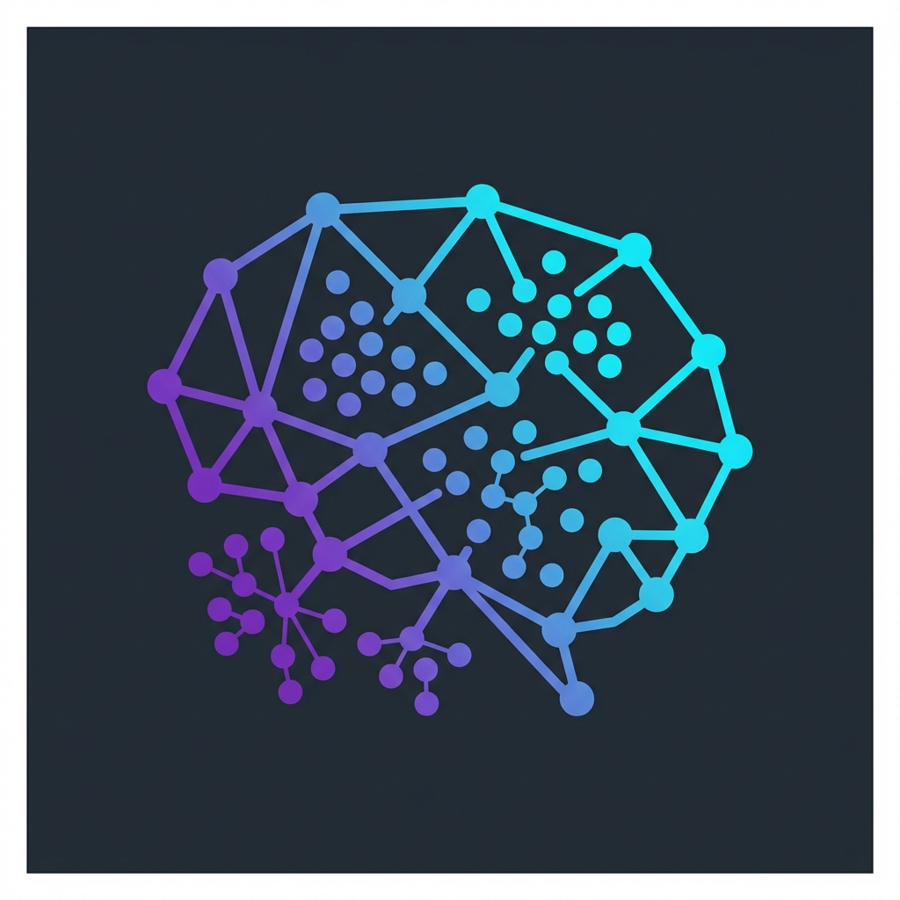
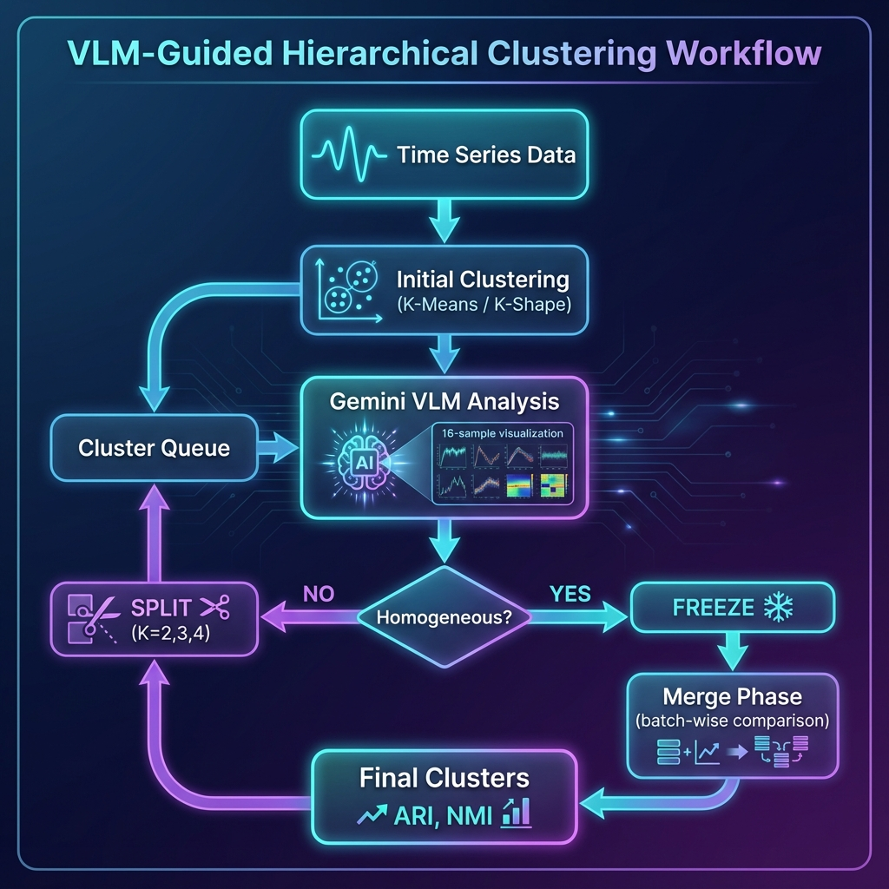
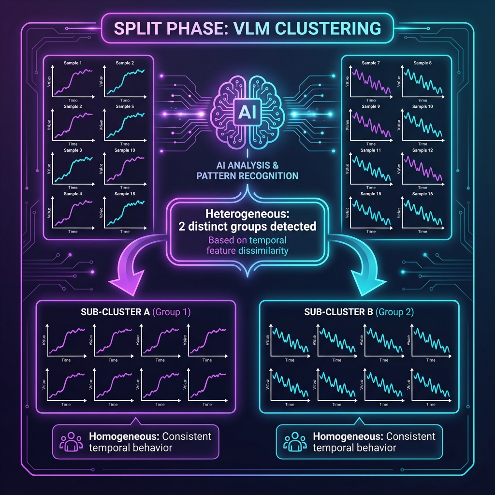
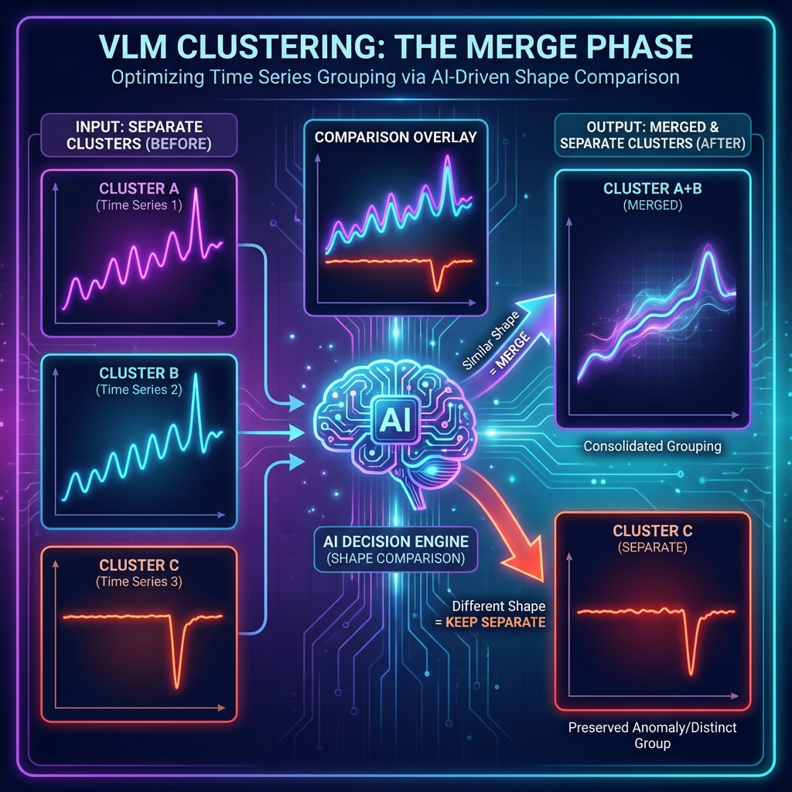

<p align="center">
  
</p>

<h1 align="center">🧠 VLM-Guided Hierarchical Clustering</h1>

<p align="center">
  <em>Vision-Language Model powered intelligent clustering for InSAR time series analysis</em>
</p>

<p align="center">
  <a href="#-features"></a>
  <a href="#-quick-start"></a>
  <a href="LICENSE"></a>
</p>

<p align="center">
  <a href="https://bcankara.com"></a>
  <a href="https://deformationdb.com"></a>
  <a href="https://insar.tr"></a>
</p>

---

## 📋 Table of Contents

- [Overview](#-overview)
- [Downloadable Data](#-downloadable-data)
- [Features](#-features)
- [How It Works](#-how-it-works)
- [Quick Start](#-quick-start)
- [Ground Truth Data](#-ground-truth-data)
- [VLM Analysis Process](#-vlm-analysis-process)
- [Gemini Prompts](#-gemini-prompts-detailed)
- [Results](#-results)
- [Project Structure](#-project-structure)
- [Contact](#-contact)

---

## 🎯 Overview

This project introduces a novel approach to time series clustering by leveraging **Vision-Language Models (VLMs)** to make intelligent clustering decisions. Instead of relying solely on mathematical metrics, the system uses Google's Gemini AI to visually analyze cluster samples and determine:

1. **Is the cluster homogeneous?** (Should it be frozen or split?)
2. **Which clusters should be merged?** (Do they represent the same behavior?)

This approach achieves **near-manual accuracy** (ARI > 0.95) on synthetic InSAR deformation data with 4 ground truth clusters.

---

## 📦 Downloadable Data

Experiment results and archived data are available in the **[`archive/`](archive/)** folder.

Navigate to this folder and download the following files:

| File | Size | Description |
|------|------|-------------|
| `archive.z01` | ~2 GB | Split archive - Part 1 |
| `archive.z02` | ~700 MB | Split archive - Part 2 |
| `archive.zip` | ~50 MB | Split archive - Main file |
| `results_final.zip` | ~1.8 GB | Final experiment results |

### ⚠️ Important: Split Archive Instructions

The `archive.zip` is split into multiple parts due to file size limits:

1. **Download ALL parts** (`archive.z01`, `archive.z02`, `archive.zip`) to the **same folder**
2. **Extract `archive.zip`** - it will automatically combine all parts
3. You need **all parts** to extract successfully

### Archive Contents

```
archive.zip (when extracted)
├── failed_experiments/        # Over-merge cases and debugging data
├── intermediate_results/      # K-value experiments (K=2 to K=30)
├── phase_0_baby_steps/        # Initial development and ground truth data
├── phase_1_working/           # Working prototypes
├── phase_2_zone_verification/ # Zone-based verification tests
└── README.md                  # Detailed archive documentation
```

### Results Final Contents

```
results_final.zip (when extracted)
├── Gemini_2-5_Pro/    # Best performing model results
├── Gemini_3_Flash/    # Flash model experiments
└── Gemini_3_Pro/      # Pro model experiments
```

> 💡 **Tip**: These archives contain detailed experiment logs, visualizations, and JSON reports.

---

## ✨ Features

<table>
<tr>
<td width="50%">

### 🤖 AI-Powered Analysis
Google Gemini VLM analyzes 16-sample visualizations to detect heterogeneous clusters that mathematical metrics might miss.

### 📊 Multi-Algorithm Support
- **K-Means** - Fast centroid-based clustering
- **K-Shape** - Shape-based for time series
- **Hierarchical** - Dendrogram-based merging

</td>
<td width="50%">

### 🔄 Iterative Refinement
Queue-based processing: Split heterogeneous clusters, freeze homogeneous ones, then merge similar groups.

### 📈 Academic Metrics
- **ARI** (Adjusted Rand Index)
- **NMI** (Normalized Mutual Information)
- Full reproducibility testing framework

</td>
</tr>
</table>

---

## 🔬 How It Works

<p align="center">
  
</p>

### The Two-Phase Process

<table>
<tr>
<td width="50%" valign="top">

### Phase 1: Split Analysis

<p align="center">
  
</p>

1. Initial clustering creates K clusters
2. Each cluster is visualized (16 diverse samples)
3. Gemini VLM analyzes homogeneity
4. Heterogeneous clusters are SPLIT
5. Process repeats until all homogeneous

</td>
<td width="50%" valign="top">

### Phase 2: Merge Analysis

<p align="center">
  
</p>

1. Final clusters are compared in batches of 3
2. Cluster means are overlaid/stacked
3. Gemini identifies same-behavior pairs
4. Similar clusters are MERGED
5. Final K is determined

</td>
</tr>
</table>

---

## 🚀 Quick Start

### 1. Installation

```bash
# Clone the repository
git clone https://github.com/bcankara/vlm-guided-clustering.git
cd vlm-guided-clustering

# Install dependencies
pip install -r requirements.txt
```

### 2. Configure API Key

Edit `settings.json`:

```json
{
  "gemini_api_key": "YOUR_GEMINI_API_KEY",
  "gemini_model": "gemini-2.5-pro",
  "k_range": [2, 8],
  "min_cluster_size": 25,
  "merge_viz_mode": "v2"
}
```

> 💡 **Get your free API key**: [Google AI Studio](https://aistudio.google.com/)

### 3. Run

```bash
python main.py
```

**Menu Options:**
| Option | Description |
|:------:|-------------|
| 1-3 | Baseline algorithms (no VLM) |
| 4-6 | **VLM-Guided** algorithms ⭐ |
| 7 | Fixed K=4 comparison |
| 8 | Reproducibility test (6× runs) |

---

## 📊 Ground Truth Data

The synthetic dataset contains **10,000 points** with **4 distinct deformation behaviors**:

<p align="center">
  
</p>

| Cluster | Behavior | Description |
|:-------:|----------|-------------|
| **A** | Monotonic Subsidence | Steady downward linear trend |
| **B** | Seasonal Recovery | Downward trend + seasonal oscillation |
| **C** | Periodic Fast/Slow | Alternating yearly deformation rates |
| **D** | Stabilizing | Initially fast, exponentially slowing |

---

## 🔍 VLM Analysis Process

### Sample Visualization (16-Grid)

For each cluster, the system:
1. Selects 16 diverse samples using extremes + grid-based sampling
2. Sorts by slope (most negative → least negative)
3. Creates a 4×4 visualization grid
4. Sends to Gemini with analysis prompt

### Decision Logic

```
IF trends are OPPOSITE (↑ vs ↓)     → SPLIT immediately
IF shapes are DIFFERENT             → SPLIT
IF peaks/valleys misaligned        → SPLIT (if major)
IF indistinguishable               → FREEZE ❄️
```

---

## 📝 Gemini Prompts (Detailed)

### 1. Homogeneity Analysis Prompt

**Used by**: `analyze_with_gemini()`

**Input**: 4×4 grid image of 16 time series samples

**Key Instructions**:
```
SAME REGION = Curves show consistent deformation behavior 
              with matching shape and trend.
              
DIFFERENT REGIONS = Curves show different behaviors 
                    (opposite trends, different shapes, 
                    or major shifting peaks).
```

**Output Format**:
```json
{
  "is_homogeneous": true/false,
  "should_split": true/false,
  "distinct_groups": 2,
  "confidence": 85
}
```

---

### 2. Self-Correction (Reflexion) Prompt

**Triggered when**: SPLIT decision with confidence < 80%

**Purpose**: Reduce false positives by requesting verification

```
Are you ABSOLUTELY CERTAIN these are from different regions?

Remember:
- Minor noise differences are NORMAL
- Small phase shifts are ACCEPTABLE
- Only split if there is UNDENIABLE proof
```

---

### 3. Merge Prompt V2 (Default)

**Used by**: `iterative_merge_with_gemini()`

**Visual**: Each cluster in separate subplot with shared Y-axis

**Critical Distinction**:
```
1. LINEAR TREND DEPTH:
   Differences OK! (-60mm vs -120mm = SAME behavior, different scale)

2. SEASONAL WAVE AMPLITUDE:
   Differences NOT OK! (10mm waves vs 40mm waves = DIFFERENT behavior)
```

**Merge Criteria**:
- ✅ Same wave pattern (peaks at same times)
- ✅ Similar seasonal amplitude relative to each other
- ❌ One has strong waves, another weak/none → DON'T MERGE
- ❌ Opposite overall trends → DON'T MERGE

---

## 📈 Results

### Performance Comparison

| Algorithm | Found K | ARI | NMI | Status |
|-----------|:-------:|:---:|:---:|:------:|
| K-Means Baseline | 6 | 0.48 | 0.52 | ⚠️ Over-split |
| K-Shape Baseline | 8 | 0.45 | 0.50 | ⚠️ Over-split |
| **K-Means + VLM** | **4** | **0.95** | **0.93** | ✅ Optimal |
| **K-Shape + VLM** | **4** | **0.99** | **0.98** | ✅ Near-perfect |
| **Hierarchical + VLM** | **4** | **0.92** | **0.90** | ✅ Good |

> 🎯 Ground Truth: K=4 clusters

### Key Findings

- VLM guidance correctly identifies the true number of clusters
- K-Shape + VLM achieves near-manual accuracy (ARI gap < 0.01)
- Self-correction prompt reduces false positive splits by ~30%

---

## 📁 Project Structure

```
vlm-guided-clustering/
│
├── 📄 main.py                  # Main application with menu
├── 📄 generate_data.py         # Synthetic data generator
├── 📄 run_reproducibility.py   # Reproducibility testing
├── 📄 config.py                # Configuration constants
├── 📄 settings.json            # User settings (API key)
├── 📄 requirements.txt         # Python dependencies
│
├── 📁 src/
│   ├── settings.py             # Settings management
│   ├── tracker.py              # Experiment tracking
│   └── scientific_logger.py    # Scientific logging
│
├── 📁 docs/
│   ├── logo.png                # Project logo
│   ├── vlm_clustering_diagram.png
│   ├── split_phase.png
│   ├── merge_phase.png
│   └── ground_truth.png
│
└── 📁 archive/                 # Downloadable data archives
    ├── 📦 archive.zip          # Archived experiments (2.7 GB)
    ├── 📦 archive.z01          # Split archive part 1
    ├── 📦 archive.z02          # Split archive part 2
    └── 📦 results_final.zip    # Final results (1.8 GB)
```

---

## 📜 License

This project is licensed under the **MIT License** - see the [LICENSE](LICENSE) file for details.

---

## 👤 Contact

<p align="center">
  
</p>

<p align="center">
  <a href="mailto:burakcankara@gmail.com">
    
  </a>
  <a href="https://bcankara.com">
    
  </a>
</p>

<p align="center">
  <a href="https://deformationdb.com">
    
  </a>
  <a href="https://insar.tr">
    
  </a>
</p>

---

<p align="center">
  <sub>🔬 Built for InSAR time series analysis research | © 2026</sub>
</p>
