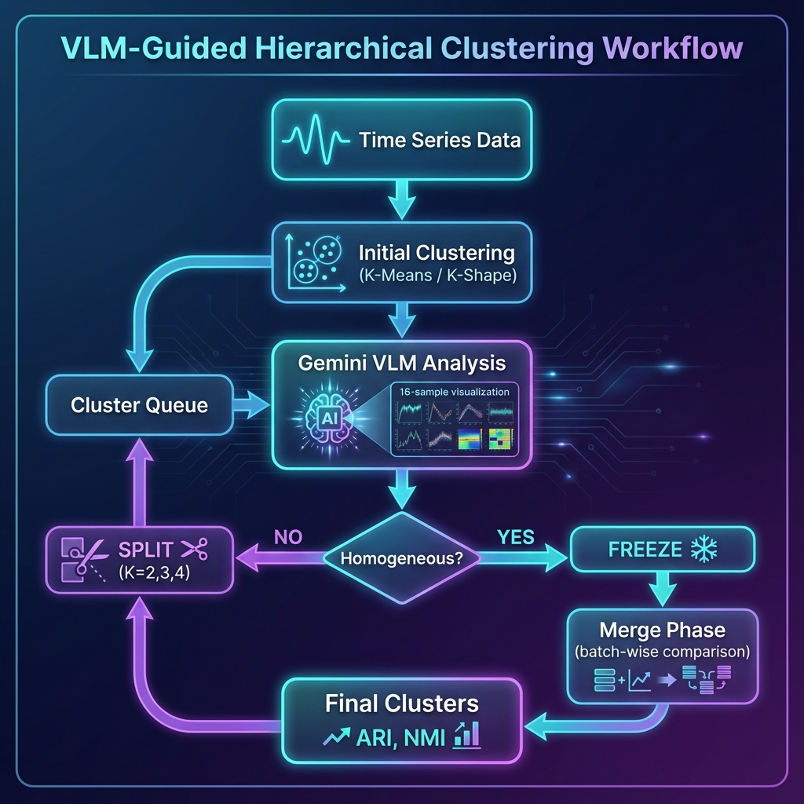
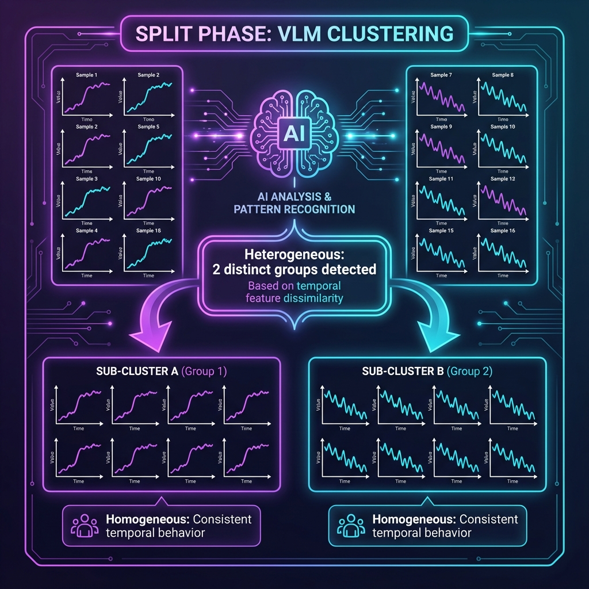
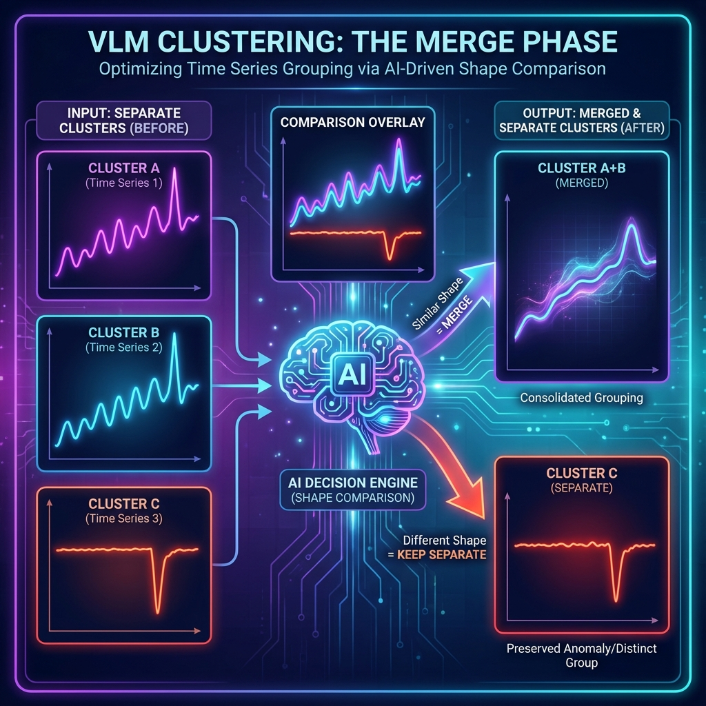

<p align="center">
  
</p>

<h1 align="center">VLM-Guided Hierarchical Clustering</h1>

<p align="center">
  <em>Vision-Language Models as the decision-maker for time-series clustering of InSAR deformation data</em>
</p>

<p align="center">
  <a href="#-overview"></a>
  <a href="#-quick-start"></a>
  <a href="mit_license.md"></a>
  <a href="#-data--archives"></a>
</p>

<p align="center">
  <a href="https://bcankara.com"></a>
  <a href="https://deformationdb.com"></a>
  <a href="https://insar.tr"></a>
</p>

---

## 📋 Table of Contents

- [Overview](#-overview)
- [Why Visual Reasoning](#-why-visual-reasoning)
- [How It Works](#-how-it-works)
- [Quick Start](#-quick-start)
- [Ground Truth Data](#-ground-truth-data)
- [Results](#-results)
- [Peer-Review Validation](#-peer-review-validation)
- [Gemini Prompts](#-gemini-prompts)
- [Data & Archives](#-data--archives)
- [Project Structure](#-project-structure)
- [License & Contact](#-license--contact)

---

## 🎯 Overview

This project treats clustering as a **perceptual decision problem**. Instead of selecting the
number of clusters from internal metrics alone, the pipeline renders each candidate cluster as a
plot and asks a **Vision-Language Model (VLM)** — Google Gemini — to make two judgments:

1. **Is this cluster homogeneous?** If not, it is *split*.
2. **Do these clusters describe the same behavior?** If so, they are *merged*.

The VLM acts as the autonomous judge of cluster structure; ground-truth labels are used **only to
evaluate** the final result, never to steer the pipeline. On synthetic InSAR deformation data with
four known regimes, this recovers the true cluster count where conventional automatic selection
fails — reaching **ARI ≈ 0.99** with the strongest backbone, against **≈ 0.13–0.50** for
silhouette-based auto-K.

> This repository accompanies ongoing research on VLM-guided clustering for InSAR time-series
> analysis. The complete development history, benchmark runs, and peer-review experiments are
> archived openly (see [Data & Archives](#-data--archives)).

---

## 💡 Why Visual Reasoning

Two time series can be numerically close yet behave differently — a steady subsidence versus a
seasonal oscillation of similar magnitude. Rendered as plots, that difference is immediately
visible, and this is precisely what the VLM exploits.

A controlled **modality ablation** confirms the gain comes from the *visual* representation, not
merely from using a language model: feeding the model the **same series as numeric text** — with
model, prompt, and pipeline held fixed — lowers ARI by **0.34–0.44** and destabilizes the
recovered cluster count (visual: K = 4 in 35/36 runs, ARI std ≈ 0.01; text-only: K = 1–9, ARI
std ≈ 0.3). Details in [`archive/revisions_r1.zip`](#-data--archives).

---

## 🔬 How It Works

<p align="center">
  
</p>

<table>
<tr>
<td width="50%" valign="top">

### Phase 1 · Split

<p align="center">
  
</p>

1. Initial clustering creates K clusters
2. Each cluster is rendered (16 diverse samples)
3. The VLM assesses homogeneity
4. Heterogeneous clusters are **split**
5. Repeats until every cluster is homogeneous

</td>
<td width="50%" valign="top">

### Phase 2 · Merge

<p align="center">
  
</p>

1. Surviving clusters are compared in batches of three
2. Cluster means are overlaid for inspection
3. The VLM identifies same-behavior groups
4. Similar clusters are **merged**
5. The final K is determined

</td>
</tr>
</table>

> **Fully autonomous by design.** The VLM's merge decision is applied as-is. The pipeline contains
> **no ground-truth gate** — earlier versions kept a merge only if it improved the ground-truth ARI,
> which is label leakage and unavailable in real deployment. Ground truth now enters **only** at the
> final scoring step.

---

## 🚀 Quick Start

### 1 · Install

```bash
git clone https://github.com/bcankara/vlm-guided-clustering.git
cd vlm-guided-clustering
pip install -r requirements.txt
```

> **K-Shape (tslearn)** needs a compatible stack: **Python 3.11 + numba 0.60 + tslearn 0.8**.
> Python 3.13 / numba 0.61 is known to crash the K-Shape backend.

### 2 · Configure

Edit `settings.json`:

```json
{
  "gemini_api_key": "YOUR_GEMINI_API_KEY",
  "gemini_model": "gemini-3-flash-preview",
  "k_range": [2, 8],
  "min_cluster_size": 25,
  "merge_viz_mode": "v2"
}
```

> 🔑 Get a free key at **[Google AI Studio](https://aistudio.google.com/)**. Keep it local — a
> `settings.json` containing a real key should **never** be committed.

### 3 · Run

```bash
python main.py
```

| Option | Description |
|:------:|-------------|
| 1–3 | Baseline algorithms (no VLM) |
| 4–6 | **VLM-guided** algorithms ⭐ |
| 7 | Fixed K = 4 comparison (oracle) |
| 8 | Reproducibility test (repeated runs) |

---

## 📊 Ground Truth Data

A synthetic dataset of **10,000 points** with **four distinct deformation behaviors**:

<p align="center">
  
</p>

| Cluster | Behavior | Description |
|:-------:|----------|-------------|
| **A** | Monotonic subsidence | Steady downward linear trend |
| **B** | Seasonal recovery | Downward trend with seasonal oscillation |
| **C** | Periodic fast/slow | Alternating yearly deformation rates |
| **D** | Stabilizing | Initially fast, exponentially slowing |

---

## 📈 Results

**Gemini 3 Flash**, 12 runs per configuration. ARI reported as mean [95 % bootstrap CI].

| Backbone | Auto-K baseline | Oracle (fixed K=4) | **VLM-guided** | Recovered K |
|----------|:---------------:|:------------------:|:--------------:|:-----------:|
| K-Means | 0.13 | 0.24 | **0.935** `[0.929, 0.940]` | 4 |
| Hierarchical | 0.13 | 0.25 | **0.949** `[0.930, 0.969]` | 4 |
| K-Shape | 0.50 | 0.63 | **0.994** `[0.994, 0.994]` | 4 |

> 🎯 Ground truth: **K = 4**.

**Key findings**

- VLM guidance recovers the correct cluster count where silhouette-based auto-K does not.
- Every model × backbone configuration significantly exceeds its baseline (Holm-corrected
  *p* < 0.005).
- **Gemini 3 Flash + K-Shape** is the strongest and most stable setting (ARI 0.994, CI width 0.000).
- Full multi-model results (Gemini **2.5 Pro / 3 Flash / 3 Pro** × three backbones) and the
  statistical tests are in [`archive/results_final.zip`](#-data--archives).

---

## 🧪 Peer-Review Validation

Supporting experiments produced during peer review are archived in
[`archive/revisions_r1.zip`](#-data--archives) — authentic drivers, raw result JSONs, run logs,
and figures.

| Experiment | Question | Headline result |
|------------|----------|-----------------|
| **Modality ablation** | Is the gain visual, or just "a language model"? | Visual beats text-only by **0.34–0.44 ARI** and is far more stable |
| **Sensitivity sweep** | Does it hold under overlap, noise, irregular sampling, imbalance? | Lifts ARI from the ~0.13 no-VLM floor to **0.64–0.83**; robust to realistic noise |
| **Statistical significance** | Are the gains real? | Bootstrap CIs + Mann-Whitney / Cliff's δ, Holm-corrected, across 3 models × 3 backbones |
| **Reproducibility** | Are results stable across runs and deterministic seeds? | Repeated and seed-fixed runs with logged outputs |

---

## 📝 Gemini Prompts

<details>
<summary><strong>1 · Homogeneity (split) prompt</strong> — <code>analyze_with_gemini()</code></summary>

**Input:** a 4×4 grid of 16 representative series from one cluster.

```
SAME REGION       = consistent deformation behavior, matching shape and trend.
DIFFERENT REGIONS = opposite trends, different shapes, or major shifting peaks.

1. Opposite trends (up vs down)        → SPLIT
2. Different shapes (wave vs straight)  → SPLIT
3. Peaks/valleys misaligned (large)     → SPLIT
4. Indistinguishable                    → FREEZE
```

**Output:** `{ "is_homogeneous": bool, "should_split": bool, "distinct_groups": int, "confidence": 0-100 }`

</details>

<details>
<summary><strong>2 · Self-correction (Reflexion) prompt</strong> — triggered on a low-confidence split</summary>

Triggered when a SPLIT decision has confidence < 80, to suppress false positives:

```
Are you ABSOLUTELY CERTAIN these are from different regions?
- Minor noise differences are NORMAL
- Small phase shifts are ACCEPTABLE
- Only split on UNDENIABLE evidence
```

A text-only counterpart, `analyze_with_gemini_text_only()`, uses the identical schema and
self-correction on numeric input — the basis of the modality ablation.

</details>

<details>
<summary><strong>3 · Merge prompt (v2, default)</strong> — <code>iterative_merge_with_gemini()</code></summary>

**Visual:** each cluster mean in its own subplot on a shared Y-axis.

```
LINEAR TREND DEPTH   → differences OK     (-60mm vs -120mm = same behavior, different scale)
SEASONAL AMPLITUDE   → differences NOT OK  (10mm vs 40mm waves = different behavior)
```

✅ same wave pattern and comparable seasonal amplitude → merge · ❌ one strong wave / one flat,
or opposite trends → keep separate.

</details>

---

## 📦 Data & Archives

All experiment data ships via **Git LFS** in [`archive/`](archive/).

| Archive | Size | Contents |
|---------|:----:|----------|
| `archive.zip` + `.z01` + `.z02` | ~2.8 GB (3-part split) | Full development history — baby-steps, baselines, K-sweeps (K = 2…30), zone verification, failed runs |
| `results_final.zip` | ~1.8 GB | Final benchmarks — Gemini 2.5 Pro / 3 Flash / 3 Pro × three backbones, plus `statistics/` |
| `revisions_r1.zip` | ~685 MB | Peer-review supporting experiments (modality ablation, sensitivity, significance, reproducibility) |

### Cloning with (or without) the data

A normal clone fetches the LFS data automatically. To skip the large archives and pull them later:

```bash
GIT_LFS_SKIP_SMUDGE=1 git clone https://github.com/bcankara/vlm-guided-clustering.git
git lfs pull          # fetch the archives when you need them
```

### Extracting the split archive

Download **all three** parts (`archive.z01`, `archive.z02`, `archive.zip`) into the **same folder**
and extract `archive.zip` — the parts recombine automatically.

```
archive.zip                       results_final.zip      revisions_r1.zip
├── phase_0_baby_steps/           ├── Gemini_2-5_Pro/    ├── R2-01_modality_ablation/
├── phase_1_baseline/             ├── Gemini_3_Flash/    ├── R2-06_sensitivity_analysis/
├── phase_2_zone_verification/    ├── Gemini_3_Pro/      ├── R2-11_statistical_significance/
├── intermediate_results/         └── statistics/        └── R2-16-18_reproducibility/
└── failed_experiments/
```

---

## 📁 Project Structure

```
vlm-guided-clustering/
├── main.py                  # Pipeline + interactive menu (split / merge / VLM logic)
├── generate_data.py         # Synthetic InSAR data generator
├── run_reproducibility.py   # Repeated-run reproducibility harness
├── config.py                # Configuration constants
├── settings.json            # User settings (model, k_range, API key)
├── requirements.txt         # Python dependencies
├── mit_license.md           # MIT license
│
├── src/
│   ├── settings.py          # Settings management
│   ├── tracker.py           # Experiment tracking
│   └── scientific_logger.py # Structured scientific logging
│
├── docs/                    # Logo, workflow diagram, phase & ground-truth figures
│
└── archive/                 # Git-LFS data (development history, results, revision experiments)
    ├── archive.zip + .z01 + .z02
    ├── results_final.zip
    └── revisions_r1.zip
```

---

## 📜 License & Contact

Released under the **MIT License** — see [`mit_license.md`](mit_license.md).

<p align="center">
  
</p>

<p align="center">
  <a href="mailto:burakcankara@gmail.com"></a>
  <a href="https://bcankara.com"></a>
  <a href="https://deformationdb.com"></a>
  <a href="https://insar.tr"></a>
</p>

<p align="center">
  <sub>🔬 VLM-guided clustering for InSAR time-series analysis · © 2026 Dr. Burak Can KARA</sub>
</p>
